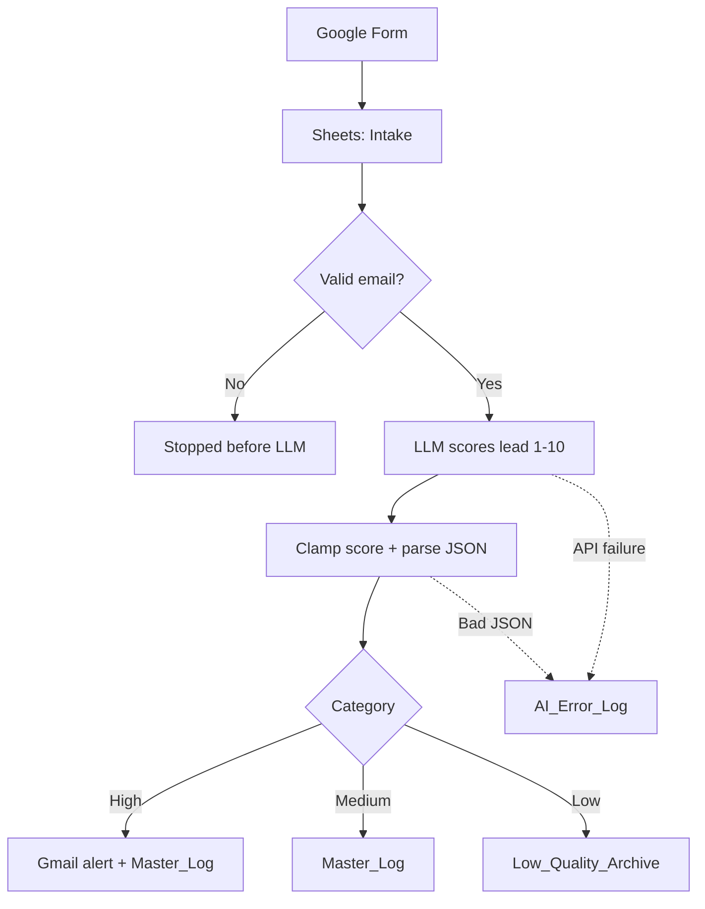

# AI-Powered Lead Qualification & CRM Automation

A Make.com scenario that takes raw leads from a Google Form, checks them, scores them with an LLM, and routes them without anyone triaging by hand. Hot leads trigger an email alert. Weak leads get archived. Everything is logged, including failures.

Production ready development: validate before spending tokens, never trust the model's output blindly, and never lose a lead silently.

## What it does

1. A lead submits a Google Form. The response lands in a Google Sheets `Intake` tab, which triggers the scenario.
2. A router checks the email with a regex. Invalid emails stop here and never reach the LLM.
3. The LLM (temperature 0, for repeatable scoring) rates the lead from 1 to 10 and assigns a category.
4. The score is clamped to the 1-10 range, in case the model returns something out of bounds.
5. The lead is routed by category:
   - **High**: logged, and a Gmail alert goes to the sales team.
   - **Medium**: logged to `Master_Log` for follow-up.
   - **Low**: moved to `Low_Quality_Archive`.

## Flow



## Error handling

Two separate handlers, because the two failures need different diagnosis:

| Failure | Cause | Result |
|---|---|---|
| LLM API error | Rate limit, timeout, provider outage | Lead and error details written to `AI_Error_Log` |
| JSON parse error | Model returned malformed or non-JSON output | Raw response and lead written to `AI_Error_Log` |

Either way, the lead is kept and can be reprocessed. Nothing is dropped.

## Google Sheets structure

| Tab | Purpose |
|---|---|
| `Intake` | Raw form responses, scenario trigger |
| `Master_Log` | Every processed lead with score and category |
| `Low_Quality_Archive` | Leads scored as low quality |
| `AI_Error_Log` | LLM and parsing failures for review |

## Stack

- Make.com (scenario orchestration)
- LLM API (lead scoring and categorization)
- Google Forms and Google Sheets (intake and logging)
- Gmail (high-priority alerts)

## Setup

1. Create the Google Form and link it to a Sheet with the four tabs above.
2. In Make.com, create a new scenario and import `Workflow JSON/AI-Powered Lead Qualification & CRM Automation.blueprint.json`, or rebuild it from the screenshot in `Workflow Screenshoot/`.
3. Reconnect your own Google Sheets and Gmail connections, and add your LLM API key.
4. Point the modules at your spreadsheet and set the alert recipient.
5. Turn the scenario on and submit a test response.

> Connection IDs and spreadsheet IDs are removed from the exported blueprint. You'll need to reselect them after import.

## Design notes

- **Validate before the model.** Bad emails are filtered with a regex first, so no tokens are spent on junk.
- **Temperature 0.** Same lead in, same score out, which makes the results easier to audit.
- **Clamp the score.** `max(1; min(10; score))` guards against the model returning 0, 11, or something odd.
- **Defensive mapping.** Optional fields are wrapped with `ifempty()` so a blank answer doesn't break a module.
- **Log failures, don't swallow them.** A dedicated error tab means problems are visible and fixable.

## Repo contents

```
.
├── AI_Lead_Qualification_Explanation_Report.pdf   # Detailed technical explanation & architectural report
├── Google Sheets Link.docx                         # Link to Google Sheets database setup
├── README.md                                       # Main project documentation
├── Execution Videos/                               # Demo videos covering execution scenarios & edge cases
│   ├── AI Error response.mp4
│   ├── High Quality Lead Sending Mail to Sales.mp4
│   ├── Invalid Mail No AI node calling.mp4
│   ├── Low Quality Lead Archive.mp4
│   └── Medium Quality Lead Storing without Mail Sending.mp4
├── Loom Video Presentation/                        # Video presentation link
│   └── Loom Video Link.docx
├── Workflow JSON/                                  # Exported Make.com scenario blueprint
│   └── AI-Powered Lead Qualification & CRM Automation.blueprint.json
└── Workflow Screenshoot/                           # Visual workflow diagram screenshot
    └── Workflow Screenshoot.png
```

## Possible next steps

- Push High leads into a real CRM (HubSpot, Pipedrive) instead of just email.
- Add a feedback column so sales can mark scores right or wrong, then use it to tune the prompt.
- Add a duplicate check on email before scoring.

## Author

**Ajhar**, AI automation engineer. Open to freelance automation work.
